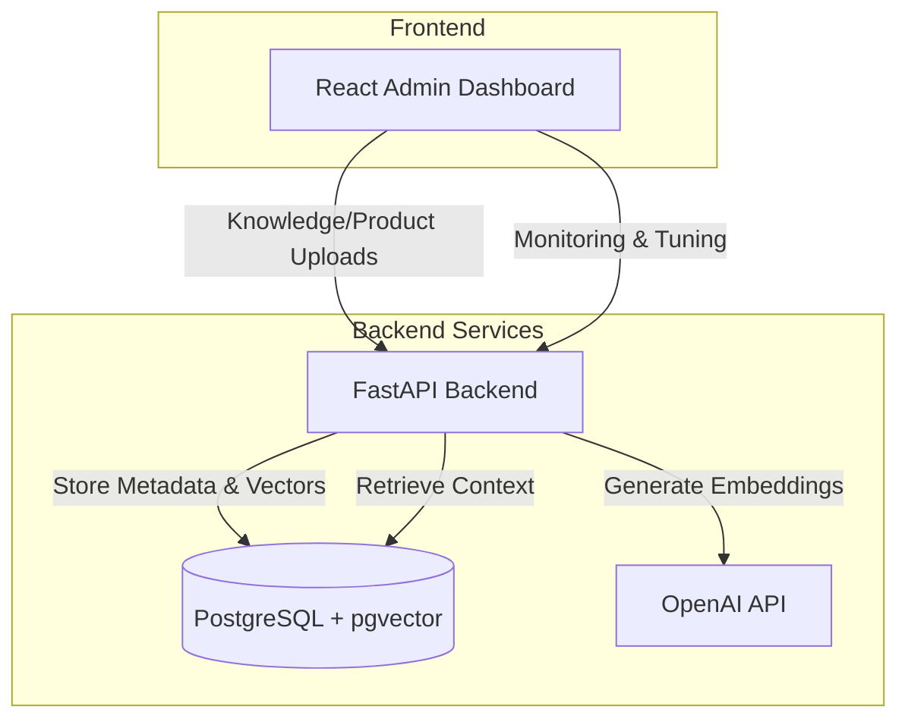

# GenAI Knowledge & Product Architecture

## System Overview

## Components

### Frontend-Admin
React-based dashboard for managing knowledge and products:
- **Framework**: React 18 + TypeScript + Vite
- **Styling**: Tailwind CSS
- **Features**:
  - Knowledge CSV upload
  - Product tuning controls
  - QA monitoring

### Backend API
FastAPI application serving as the core engine:
- **Framework**: FastAPI (Python 3.12)
- **Functions**:
  - **Knowledge Import**: Parses CSV uploads into articles, versions, and chunks.
  - **Vector Embedding**: Generates embeddings using OpenAI `text-embedding-3-small`.
  - **Search**: Performs cosine similarity search via pgvector.
  - **Product Tuning**: Updates visibility/featured/priority and master codes.

### Database
PostgreSQL (v16+) extended with `pgvector`:
- **Tables**:
  - `knowledge_uploads`, `knowledge_articles`, `knowledge_article_versions`
  - `knowledge_chunks`, `knowledge_embeddings`
  - `products`, `product_embeddings`, `product_groups`
  - `product_uploads`, `product_changes`
  - `qa_logs`

## Data Flow

### 1. Knowledge CSV Import
1. **Upload**: Admin sends CSV via `/api/v1/import/knowledge`.
2. **Parse**: Backend creates articles, versions, and chunks.
3. **Embed**: Embeddings are generated for chunks.
4. **Retrieve**: Chat pipeline pulls relevant chunks by similarity.

### 2. Product CSV Import
1. **Upload**: Admin sends CSV via `/api/v1/import/products`.
2. **Normalize**: Attributes are normalized (material, gauge, threading).
3. **Index**: `search_text` + `search_keywords` are built.
4. **Embed**: Product embeddings are generated.

## Security & Deployment

- **Environment Config**: Credentials managed via `.env` file.
- **CORS**: Configured to allow frontend-backend communication.
- **Containerization**: Docker support available for deployment.
