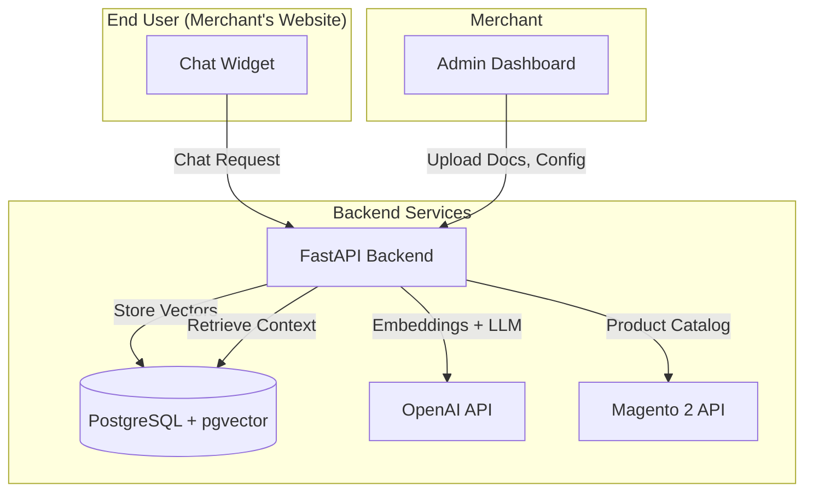

# GenAI SaaS Architecture

## System Overview

## Components

### Frontend-Admin
Merchant dashboard for:
- Document upload (PDF/DOC/CSV)
- Magento store connection
- Widget customization
- Analytics and usage tracking

### Frontend-Widget
Embeddable chat widget for end-users:
- Lightweight React component
- Built as IIFE bundle
- Customizable theme
- Product carousel display

### Backend
FastAPI application handling:
- **RAG Pipeline**: Document processing, chunking, embedding, retrieval
- **Chat API**: Context-aware responses with LLM
- **Magento Integration**: Product catalog sync and search
- **Multi-tenancy**: Merchant isolation and API key management
- **Authentication**: JWT for admin, API keys for widget

### Database
PostgreSQL with pgvector extension:
- Merchant data
- Document metadata
- Vector embeddings
- Chat history

## Data Flow

### Document Upload Flow
1. Merchant uploads document via Admin Dashboard
2. Backend extracts text and chunks it
3. Generate embeddings via OpenAI
4. Store vectors in pgvector with merchant_id

### Chat Flow
1. End-user sends message via Widget
2. Backend retrieves merchant config
3. Search relevant document chunks (vector similarity)
4. Optionally search Magento products
5. Generate response with LLM (context + products)
6. Return message + product carousel

## Security

- **Admin**: JWT authentication
- **Widget**: API key per merchant
- **Multi-tenancy**: Row-level security, merchant_id isolation
- **Rate limiting**: Per merchant, per endpoint
