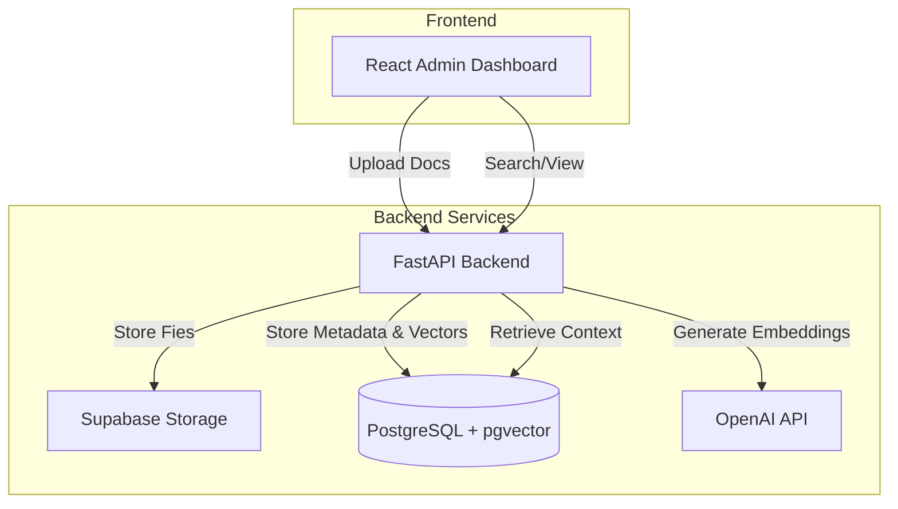

# GenAI Document Management Architecture

## System Overview

## Components

### Frontend-Admin
React-based dashboard for managing documents:
- **Framework**: React 18 + TypeScript + Vite
- **Styling**: Tailwind CSS
- **Features**:
  - Document upload (drag & drop)
  - Document listing with status
  - Search interface
  - File management

### Backend API
FastAPI application serving as the core engine:
- **Framework**: FastAPI (Python 3.12)
- **Functions**:
  - **Document Processing**: Validates, parses, and chunks uploaded documents.
  - **Vector Embedding**: Generates embeddings using OpenAI `text-embedding-3-small`.
  - **Storage Management**: Handles file operations with Supabase Storage.
  - **Search**: Performs cosine similarity search via pgvector.
- **Removed Features**: Multi-tenancy and Authentication (simplification for current phase).

### Database
PostgreSQL (v16+) extended with `pgvector`:
- **Tables**:
  - `documents`: Stores metadata (filename, storage path, hash).
  - `embeddings`: Stores vector embeddings and text chunks.
  - `chat_sessions`: (Prepared for future chat features).
  - `messages`: (Prepared for future chat features).

### File Storage
**Supabase Storage**:
- **Bucket**: `documents`
- **Security**: Signed URLs for secure access.
- **Structure**: `documents/{document_id}/{filename}`

## Data Flow

### 1. Document Upload Pipeline
1. **Upload**: User sends file (PDF/DOCX/TXT/CSV) via Admin Dashboard.
2. **Validation**: Backend checks file size (max 50MB) and type.
3. **Storage**: File is uploaded to Supabase Storage bucket.
4. **Database**: Document metadata is saved to PostgreSQL.
5. **Processing (Background)**:
   - Text is extracted from the file.
   - Text is split into chunks (1000 chars, 200 overlap).
   - Embeddings are generated via OpenAI API.
   - Embeddings are stored in `embeddings` table.

### 2. Search / Retrieval Flow
1. **Query**: User submits a search query.
2. **Embedding**: Backend generates embedding for the query.
3. **Vector Search**: Database performs similarity search (cosine distance).
4. **Results**: Relevant text chunks and document metadata are returned.

## Security & Deployment

- **Environment Config**: Credentials managed via `.env` file.
- **CORS**: Configured to allow frontend-backend communication.
- **Storage Access**: Uses signed URLs to prevent public access to stored files.
- **Containerization**: Docker support available for deployment.
