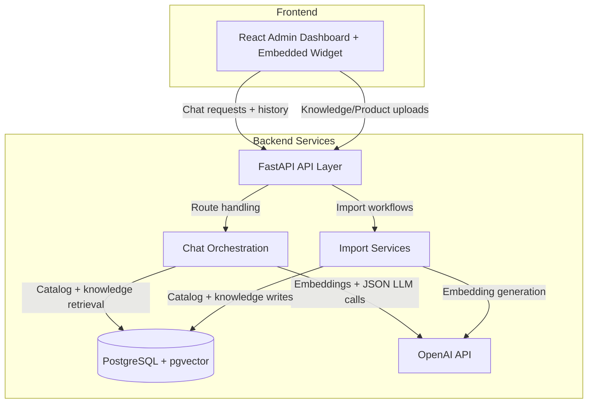

# System Overview

## Purpose
Describe the current high-level architecture for the chat-commerce platform, including runtime services, data paths, and key integration points.

## Context
This repository includes a React/Vite admin frontend and widget runtime, a FastAPI backend for chat and import APIs, and PostgreSQL with `pgvector` for catalog and knowledge retrieval.

## Content

### High-Level Architecture

### Primary Components

- Frontend admin and widget: React 18 + TypeScript + Vite, including chat widget state and admin operations.
- Backend API routes: FastAPI handlers under `backend/app/api/routes`.
- Chat orchestration: `backend/app/services/chat/service.py`, `backend/app/services/chat/unified_chat_runtime.py`, and `backend/app/services/chat/components/pipeline.py`.
- AI integration: active prompt definitions in `backend/app/prompts/nlu.py` and `backend/app/prompts/localization.py`, and execution in `backend/app/services/ai/llm_service.py`.
- Catalog retrieval: `backend/app/services/catalog/product_search.py` with structured and vector paths.
- Knowledge retrieval: `backend/app/services/knowledge/retrieval.py` and chat knowledge context assemblers.
- Persistence layer: PostgreSQL tables for conversations, messages, products, knowledge, tasks, and QA logs.

### Core Data Flows

1. Chat request flow.
   1. Widget calls `/chat/` with `user_id`, message text, locale, and optional `conversation_id`.
   2. Backend resolves conversation/user, loads history, runs NLU/routing, and retrieves products/knowledge.
   3. Backend persists user/assistant messages and optional product payload in `message`.
   4. Response returns text, carousel data, follow-up questions, and diagnostics metadata.

1. Product import flow.
   1. Admin uploads product data via import endpoints.
   2. Backend normalizes attributes, updates product entities/EAV/projections.
   3. Product embeddings and search projections are refreshed for retrieval.

1. Knowledge import flow.
   1. Admin uploads knowledge CSV.
   2. Backend parses articles, versions, and chunks.
   3. Embeddings are generated and stored for retrieval-time similarity search.

### Operational Notes

- AI calls are budgeted and guarded by configurable limits in chat runtime.
- Structured catalog lookup is preferred for explicit filters/SKU, with vector fallback when needed.
- Conversation activity windows are enforced by idle and hard-cap timeout settings.

## Related Files

- `backend/app/api/routes/chat.py`
- `backend/app/services/chat/service.py`
- `backend/app/services/chat/unified_chat_runtime.py`
- `backend/app/services/ai/llm_service.py`
- `backend/app/prompts/nlu.py`
- `backend/app/prompts/localization.py`
- `backend/app/services/catalog/product_search.py`
- `docs/database-tables.md`
